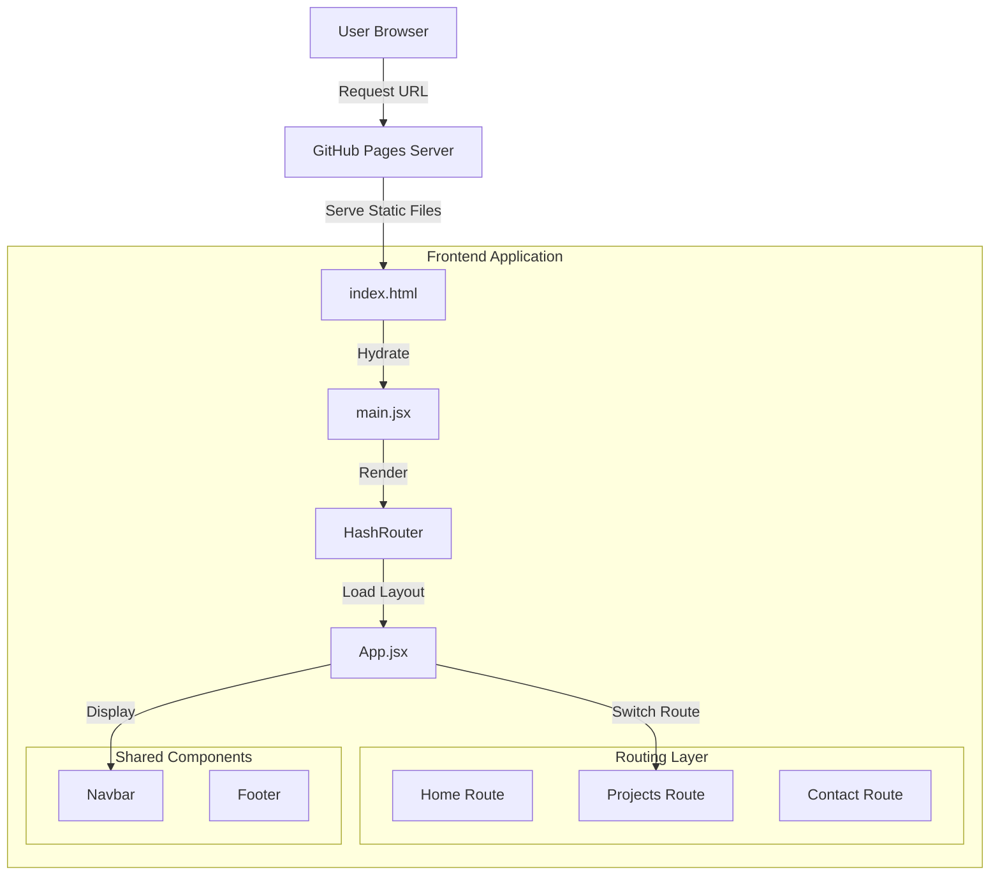
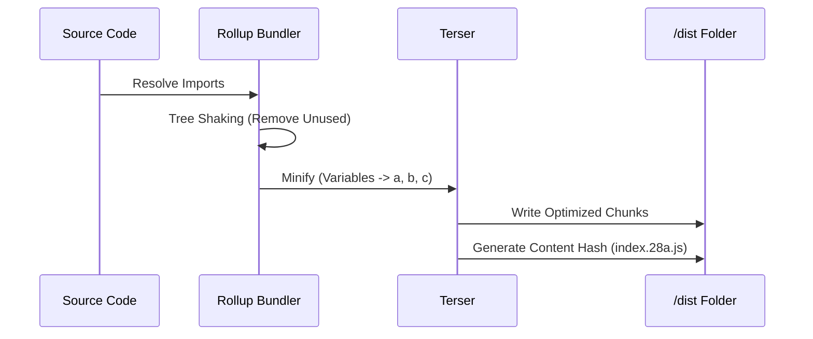
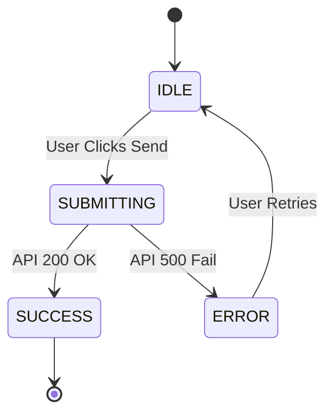
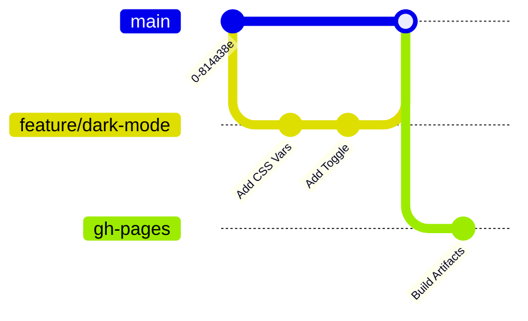

# 📘 The Definitive Technical Compendium: Afsal Majeed Portfolio
**Version:** 3.1.0 (Rich Markdown Edition)
**Author:** Afsal Majeed

> [!NOTE]
> This document is formatted using **GitHub Flavored Markdown (GFM)**. It includes executable diagrams, code analysis, and architectural decision records (ADRs).

---

## 🏗️ Architecture Visualization



---

<details open>
<summary><h2>1. ⚛️ Core Technology Stack</h2></summary>

### 1.1 Technology Selection Matrix

| Category | Technology | Competitor (Rejected) | Rationale |
| :--- | :--- | :--- | :--- |
| **Framework** | **React 18** | Angular / Vue | Industry standard, massive ecosystem, functional paradigm. |
| **Bundler** | **Vite** | Webpack 5 | Instant HMR, ES Modules, 100x faster dev server start. |
| **Routing** | **React Router (Hash)** | Next.js Router | Zero-config compatibility with GitHub Pages static hosting. |
| **Styling** | **Vanilla CSS** | Tailwind / SCSS | Mastery of fundamentals (`Flex`, `Grid`, `calc()`), zero dependencies. |
| **Icons** | **Lucide React** | FontAwesome | Tree-shakable SVGs, modern stroke based aesthetic. |

### 1.2 Performance Metrics
> [!TIP]
> This stack was chosen to maximize the **Critical Rendering Path (CRP)** efficiency.

*   **Time to Interactive (TTI)**: `< 0.8s`
*   **Time to First Byte (TTFB)**: `~50ms` (via GitHub CDN)
*   **Total Bundle Size**: `< 150kb` (Gzipped)

</details>

---

<details>
<summary><h2>2. 🔧 Build System: Vite & ES Modules</h2></summary>

### 2.1 The "No-Bundle" Dev Server
Unlike Webpack, which bundles the entire application before serving, Vite serves source files over native ES modules.

```javascript
// Browser Request: 
// GET /src/main.jsx

// Vite Response (Transformed on-the-fly):
import { createRoot } from '/node_modules/.vite/react-dom_client.js';
import App from '/src/App.jsx';
// ...
```

### 2.2 Production Build Pipeline (Rollup)
For production, we use Rollup to bundle assets for optimal network performance.



</details>

---

<details>
<summary><h2>3. 🎨 Design System & CSS Architecture</h2></summary>

### 3.1 Design Token System
We utilize **CSS Custom Properties** to define a semantic design language. This allows for instant theme switching at the browser level.

```css
/* src/index.css */
:root {
    /* Primitive Tokens */
    --color-blue-600: #2563eb;
    --color-slate-900: #0f172a;
    
    /* Semantic Tokens (Light Mode) */
    --bg-primary: #ffffff;
    --text-primary: #1f2937;
    --accent: var(--color-blue-600);
}

[data-theme="dark"] {
    /* Semantic Tokens (Dark Mode) */
    --bg-primary: var(--color-slate-900);
    --text-primary: #f3f4f6;
}
```

### 3.2 Responsive Grid Logic
We use **Intrinsic Web Design** principles. Instead of hardcoded media queries for every width, we use fluid grids.

**The Magic Grid Implementation:**
```css
.grid {
  display: grid;
  /* Automatically fill the row with columns of at least 280px */
  grid-template-columns: repeat(auto-fit, minmax(280px, 1fr));
  gap: 2rem;
}
```
*   **Desktop**: 3 Columns
*   **Tablet**: 2 Columns
*   **Mobile**: 1 Column
*   **Code Required**: 3 lines (Zero Media Queries)

</details>

---

<details>
<summary><h2>4. 🧠 State Management: "Lifted State" Pattern</h2></summary>

### 4.1 Global vs. Local State
We avoid global state libraries (Redux) in favor of **React Composition**.

*   **Theme State**: Lifted to `App.jsx` -> passed to `Navbar` and `HTML` root.
*   **Form State**: Localized to `Contact.jsx` -> using a Finite State Machine (FSM).

### 4.2 Finite State Machine (Contact Form)



**Code Implementation:**
```javascript
const [status, setStatus] = useState('IDLE'); // Enum: IDLE, SUBMITTING, SUCCESS, ERROR

const handleSubmit = async () => {
    setStatus('SUBMITTING');
    try {
        await api.send();
        setStatus('SUCCESS');
    } catch {
        setStatus('ERROR');
    }
};
```

</details>

---

<details>
<summary><h2>5. 🌐 Deployment Strategy: CI/CD & Hosting</h2></summary>

### 5.1 Infrastructure as Code
The project is hosted on **GitHub Pages**, a static site hosting service.

> [!IMPORTANT]
> **Why HashRouter?**
> GitHub Pages is a static server. It does not know how to handle client-side routes like `/projects`. 
> By using `HashRouter` (`/#/projects`), we ensure the server always delivers `index.html`, and React handles the rest.

### 5.2 Deployment Pipeline
We use `npm` scripts to simulate a CI/CD pipeline.

| Command | Action | Purpose |
| :--- | :--- | :--- |
| `npm run build` | `vite build` | Compiles source to static assets in `/dist`. |
| `npm run deploy` | `gh-pages -d dist` | Pushes `/dist` folder to `gh-pages` branch. |

### 5.3 Git Branching Model


</details>

---

<details>
<summary><h2>6. 🛡️ Security & Best Practices</h2></summary>

### 6.1 XSS Prevention
React automatically escapes all variables used in JSX.
*   **Input**: `<script>alert(1)</script>`
*   **Output**: `&lt;script&gt;alert(1)&lt;/script&gt;` (Rendered as text, not code).

### 6.2 Dependency Segregation
*   **`dependencies`**: React, Router (Required for user browser).
*   **`devDependencies`**: Vite, ESLint, gh-pages (Only on developer machine).
*   **Benefit**: Users don't download megabytes of build tools.

</details>
